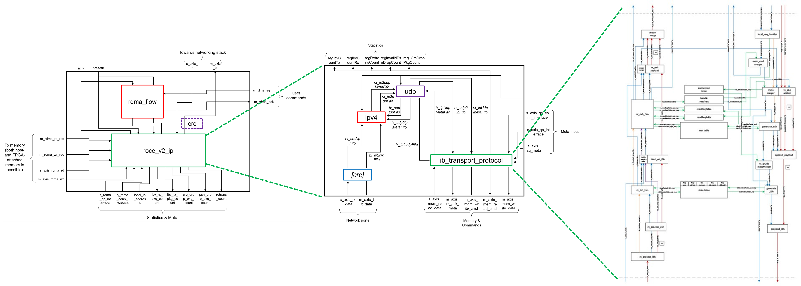

# Scalable Network Stack supporting TCP/IP, RoCEv2, UDP/IP at 10-100Gbit/s

### Prerequisites
- Xilinx Vivado 2022.2
- cmake 3.0 or higher

Supported boards (out of the box)
- Xilinx VC709
- Xilinx VCU118
- Alpha Data ADM-PCIE-7V3

#### Git submodules

This repository uses git [submodules](https://git-scm.com/book/en/v2/Git-Tools-Submodules), so do one of the following:

```bash
# When cloning:
git clone --recurse-submodules git@url.to/this/repo.git
# Later, if you forgot or when submodules have been updated:
git submodule update --init --recursive
```

## Compiling HLS modules

1. Create a build directory
```shell
mkdir build
cd build
```

2. Configure build
```shell
cmake .. -DFNS_PLATFORM=xilinx_u55c_gen3x16_xdma_3_202210_1 -DFNS_DATA_WIDTH=64
```

All cmake  options:
| Name                             | Values           | Desription                                                              |
| -------------------------------- | ---------------- | ----------------------------------------------------------------------- |
| FNS_PLATFORM                     | xilinx_u55c_gen3x16_xdma_3_202210_1 | Target platform to build
| FNS_DATA_WIDTH                   | <8,16,32,64>     | Data width of the network stack in bytes                                |
| FNS_ROCE_STACK_MAX_QPS           | 500              | Maximum number of queue pairs the RoCE stack can support
| FNS_TCP_STACK_MSS                | #value           | Maximum segment size of the TCP/IP stack                                |
| FNS_TCP_STACK_FAST_RETRANSMIT_EN | <0,1>            | Enabling TCP fast retransmit
| FNS_TCP_STACK_NODELAY_EN         | <0,1>            | Toggles Nagle's Algorithm on/off
| FNS_TCP_STACK_MAX_SESSIONS       | #value           | Maximum number of sessions the TCP/IP stack can support
| FNS_TCP_STACK_RX_DDR_BYPASS_EN   | <0,1>            | Enabling DDR bypass on the RX path
| FNS_TCP_STACK_WINDOW_SCALING_EN  | <0,1>            | Enalbing TCP Window scaling option

3. Build HLS IP cores and install them into IP repository
```
make ip
``` 

For an example project including the TCP/IP stack or the RoCEv2 stack with DMA to host memory checkout our Distributed Accelerator OS [DavOS](https://github.com/fpgasystems/davos).

## Working with individual HLS modules

1. Setup build directory, e.g. for the TCP module

```shell
cd hls/toe
mkdir build
cd build
cmake .. -DFNS_PLATFORM=xilinx_u55c_gen3x16_xdma_3_202210_1 -DFNS_DATA_WIDTH=64
```

2. Run
```shell
make csim # C-Simulation (csim_design)
make synth # Synthesis (csynth_design)
make cosim # Co-Simulation (cosim_design)
make ip # Export IP (export_design)
```

## Interfaces

All interfaces are using the AXI4-Stream protocol. For AXI4-Streams carrying network/data packets, we use the following definition in HLS:
```c
template <int D>
struct net_axis {
	ap_uint<D>    data;
	ap_uint<D/8>  keep;
	ap_uint<1>    last;
};
```

### TCP/IP

#### Open Connection
To open a connection the destination IP address and TCP port have to provided through the `s_axis_open_conn_req` interface. The TCP stack provides an answer to this request through the `m_axis_open_conn_rsp` interface which provides the sessionID and a boolean indicating if the connection was openend successfully.

Interface definition in HLS:
```c
struct ipTuple {
	ap_uint<32>	ip_address;
	ap_uint<16>	ip_port;
};
struct openStatus {
	ap_uint<16>	sessionID;
	bool		success;
};

void toe(...
	hls::stream<ipTuple>& openConnReq,
	hls::stream<openStatus>& openConnRsp,
	...);
```

#### Close Connection
To close a connection the sessionID has to be provided to the `s_axis_close_conn_req` interface. The TCP/IP stack does not provide a notification upon completion of this request, however it is guranteeed that the connection is closed eventually.

Interface definition in HLS:
```c
hls::stream<ap_uint<16> >& closeConnReq,
```

#### Open a TCP port to listen on
To open a port to listen on (e.g. as a server), the port number has to be provided to `s_axis_listen_port_req`. The port number has to be in range of active ports: 0 - 32767. The TCP stack will respond through the `m_axis_listen_port_rsp` interface indicating if the port was set to the listen state succesfully.

Interface definition in HLS:
```c
hls::stream<ap_uint<16> >& listenPortReq,
hls::stream<bool>& listenPortRsp,
```

#### Receiving notifications from the TCP stack
The application using the TCP stack can receive notifications through the `m_axis_notification` interface. The notifications either indicate that new data is available or that a connection was closed.

Interface definition in HLS:
```c
struct appNotification {
	ap_uint<16>			sessionID;
	ap_uint<16>			length;
	ap_uint<32>			ipAddress;
	ap_uint<16>			dstPort;
	bool				closed;
};

hls::stream<appNotification>& notification,
```

#### Receiving data
If data is available on a TCP/IP session, i.e. a notification was received. Then this data can be requested through the `s_axis_rx_data_req` interface. The data as well as the sessionID are then received through the `m_axis_rx_data_rsp_metadata` and `m_axis_rx_data_rsp` interface.

Interface definition in HLS:
```c
struct appReadRequest {
	ap_uint<16> sessionID;
	ap_uint<16> length;
};

hls::stream<appReadRequest>& rxDataReq,
hls::stream<ap_uint<16> >& rxDataRspMeta,
hls::stream<net_axis<WIDTH> >& rxDataRsp,
```

Waveform of receiving a (data) notification, requesting data, and receiving the data:


#### Transmitting data
When an application wants to transmit data on a TCP connection, it first has to check if enough buffer space is available. This check/request is done through the `s_axis_tx_data_req_metadata` interface. If the response through the `m_axis_tx_data_rsp` interface from the TCP stack is positive. The application can send the data through the `s_axis_tx_data_req` interface. If the response from the TCP stack is negative the application can retry by sending another request on the `s_axis_tx_data_req_metadata` interface.

Interface definition in HLS:
```c
struct appTxMeta {
	ap_uint<16> sessionID;
	ap_uint<16> length;
};
struct appTxRsp {
	ap_uint<16> sessionID;
	ap_uint<16> length;
	ap_uint<30> remaining_space;
	ap_uint<2>  error;
};

hls::stream<appTxMeta>& txDataReqMeta,
hls::stream<appTxRsp>& txDataRsp,
hls::stream<net_axis<WIDTH> >& txDataReq,
```

Waveform of requesting a data transmit and transmitting the data. 


### RoCE (RDMA over Converged Ethernet)

The new RDMA-version (02/2024) is adapted from the one used in Coyote (https://github.com/fpgasystems/Coyote) and fully compatible to the RoCE-v2 standard, thus able to communicate to standard NICs (such as i.e. Mellanox-cards). It is proven to run at 100 Gbit / s, allowing for low latency and high throughput comparable to the results achievable with mentioned ASIC-based NICs. 

The whole included design is defined in a Block Diagram as follows: 

<picture>
  
</picture>

The packet processing pipeline is coded in Vitis-HLS and included in "roce_v2_ip", consisting of separate modules for the IPv4-, UDP- and InfiniBand-Headers. In the top-level-module "roce_stack.sv", this pipeline is then combined with HDL-coded ICRC-calculation and RDMA-flow control. 

For actual usage of the RDMA-stack, it needs to be integrated into a full FPGA-networking stack and combined with some kind of shell that enables DMA-exchange with the host for both commands and memory access. An example for that is Coyote with a networking stack as depicted in the following block diagram: 

<picture>
  
</picture>

To be able to integrate the RDMA-stack into a shell-design, one must be aware of the essential interfaces. These are the following: 

#### Network Data Path 
The two ports `s_axis_rx` and `m_axis_tx` are 512-bit AXI4-Stream interfaces and used to transfer network traffic from the shell to the RDMA-stack. With the Ethernet-Header already processed in earlier parts of the networking environment, the RDMA-core expects a leading IP-Header, followed by a UDP- and InfiniBand-Header, payload and a final ICRC-checksum. 

#### Meta Interfaces for Connection Setup
RDMA operates on so-called Queue Pairs at remote communication nodes. The initial connection between Queues has to be established out-of-band (i.e. via TCP/IP) by the hosts. To exchanged meta-information then needs to be communicated to the RDMA-stack via the two meta-interfaces `s_axis_qp_interface` and `s_axis_qp_conn_interface`. The interface definition in HLS looks like this:  
```c
typedef enum {RESET, INIT, READY_RECV, READY_SEND, SQ_ERROR, ERROR} qpState;

struct qpContext {
	qpState		newState;
	ap_uint<24> qp_num;
	ap_uint<24> remote_psn;
	ap_uint<24> local_psn;
	ap_uint<16> r_key;
	ap_uint<48> virtual_address;
};
struct ifConnReq {
	ap_uint<16> qpn;
	ap_uint<24> remote_qpn;
	ap_uint<128> remote_ip_address;
	ap_uint<16> remote_udp_port;
};

hls::stream<qpContext>&	s_axis_qp_interface,
hls::stream<ifConnReq>&	s_axis_qp_conn_interface,
```

#### Issue RDMA commands
The actual RDMA-operations are handled between the shell and the RDMA-core through the interfaces `s_rdma_sq` for initiated RDMA-operations and `m_rdma_ack` to signal automatically generated ACKs from the stack to the shell. 

Definition of `s_rdma_sq`: 
- 20 Bit `rsrvd`
- 64 Bit `message_size`
- 64 Bit `local vaddr`
- 64 Bit `remote vaddr`
- 4 Bit `offs`
- 24 Bit `ssn`
- 4 Bit `cmplt`
- 4 Bit `last`
- 4 Bit `mode`
- 4 Bit `host`
- 12 Bit `qpn`
- 8 Bit `opcode` (i.e. RDMA_WRITE, RDMA_READ, RDMA_SEND etc.)

Definition of `m_rdma_ack`: 
- 24 Bit `ssn`
- 4 Bit `vfid` - Coyote-specific 
- 8 Bit `pid` - Coyote-specific 
- 4 Bit `cmplt`
- 4 Bit `rd`


#### Memory Interface 
The RDMA stack as published here and originally developed for use with the Coyote-shell is designed to use the QDMA IP-core. Therefore, the memory-control interfaces `m_rdma_rd_req` and `m_rdma_wr_req` are designed to hold all information required for communication with those cores. The two data interfaces for transportation of memory content `m_axis_rdma_wr` and `s_axis_rdma_rd` are 512-bit AXI4-Stream interfaces. 

Definition of `m_rdma_rd_req` / `m_rdma_wr_req`: 
- 4 Bit `vfid`
- 48 Bit `vaddr`
- 4 Bit `sync`
- 4 Bit `stream`
- 8 Bit `pid`
- 28 Bit `len`
- 4 Bit `host`
- 12 Bit `dest`
- 4 Bit `ctl`


#### Example of RDMA WRITE-Flow
The following flow chart shows an exemplaric RDMA WRITE-exchange between a remote node with an ASIC-based NIC and a local node with a FPGA-NIC implementing the RDMA-stack. It depicts the FPGA-internal communication between RDMA-stack and Shell as well as the network data-exchange between the two nodes: 

<picture>
  
</picture>

## Publications
- D. Sidler, G. Alonso, M. Blott, K. Karras et al., *Scalable 10Gbps
TCP/IP Stack Architecture for Reconfigurable Hardware,* in FCCM’15, [Paper](http://davidsidler.ch/files/fccm2015-tcpip.pdf), [Slides](http://fccm.org/2015/pdfs/M2_P1.pdf)

- D. Sidler, Z. Istvan, G. Alonso, *Low-Latency TCP/IP Stack for Data Center Applications,* in FPL'16, [Paper](http://davidsidler.ch/files/fpl16-lowlatencytcpip.pdf)

- D. Sidler, Z. Wang, M. Chiosa, A. Kulkarni, G. Alonso, *StRoM: smart remote memory,* in EuroSys'20, [Paper](https://dl.acm.org/doi/abs/10.1145/3342195.3387519)

## Citations
If you use the TCP/IP or RDMA stacks in your project please cite one of the following papers and/or link to the github project:

```bibtex
@inproceedings{DBLP:conf/fccm/SidlerABKVC15,
  author       = {David Sidler and
                  Gustavo Alonso and
                  Michaela Blott and
                  Kimon Karras and
                  Kees A. Vissers and
                  Raymond Carley},
  title        = {Scalable 10Gbps {TCP/IP} Stack Architecture for Reconfigurable Hardware},
  booktitle    = {23rd {IEEE} Annual International Symposium on Field-Programmable Custom
                  Computing Machines, {FCCM} 2015, Vancouver, BC, Canada, May 2-6, 2015},
  pages        = {36--43},
  publisher    = {{IEEE} Computer Society},
  year         = {2015},
  doi          = {10.1109/FCCM.2015.12}

@inproceedings{DBLP:conf/fpl/SidlerIA16,
  author       = {David Sidler and
                  Zsolt Istv{\'{a}}n and
                  Gustavo Alonso},
  title        = {Low-latency {TCP/IP} stack for data center applications},
  booktitle    = {26th International Conference on Field Programmable Logic and Applications,
                  {FPL} 2016, Lausanne, Switzerland, August 29 - September 2, 2016},
  pages        = {1--4},
  publisher    = {{IEEE}},
  year         = {2016},
  doi          = {10.1109/FPL.2016.7577319}
}

@inproceedings{DBLP:conf/eurosys/SidlerWCKA20,
  author       = {David Sidler and
                  Zeke Wang and
                  Monica Chiosa and
                  Amit Kulkarni and
                  Gustavo Alonso},
  title        = {StRoM: smart remote memory},
  booktitle    = {EuroSys '20: Fifteenth EuroSys Conference 2020, Heraklion, Greece,
                  April 27-30, 2020},
  pages        = {29:1--29:16},
  publisher    = {{ACM}},
  year         = {2020},
  doi          = {10.1145/3342195.3387519}
}

@PHDTHESIS{sidler2019innetworkdataprocessing,
	author = {Sidler, David},
	publisher = {ETH Zurich},
	year = {2019-09},
	copyright = {In Copyright - Non-Commercial Use Permitted},
	title = {In-Network Data Processing using FPGAs},
}

@INPROCEEDINGS{sidler2020strom,
	author = {Sidler, David and Wang, Zeke and Chiosa, Monica and Kulkarni, Amit and Alonso, Gustavo},
	booktitle = {Proceedings of the Fifteenth European Conference on Computer Systems},
	title = {StRoM: Smart Remote Memory},
	doi = {10.1145/3342195.3387519},
}
```

## Contributors
- [David Sidler](http://github.com/dsidler), [Systems Group](http://systems.ethz.ch), ETH Zurich
- [Monica Chiosa](http://github.com/chipet), [Systems Group](http://systems.ethz.ch), ETH Zurich
- [Fabio Maschi](http://github.com/fabiomaschi), [Systems Group](http://systems.ethz.ch), ETH Zurich
- [Zhenhao He](http://github.com/zhenhaohe), [Systems Group](http://systems.ethz.ch), ETH Zurich
- [Mario Ruiz](https://github.com/mariodruiz), HPCN Group of UAM, Spain
- [Kimon Karras](http://github.com/kimonk), former Researcher at Xilinx Research, Dublin
- [Lisa Liu](http://github.com/lisaliu1), Xilinx Research, Dublin
